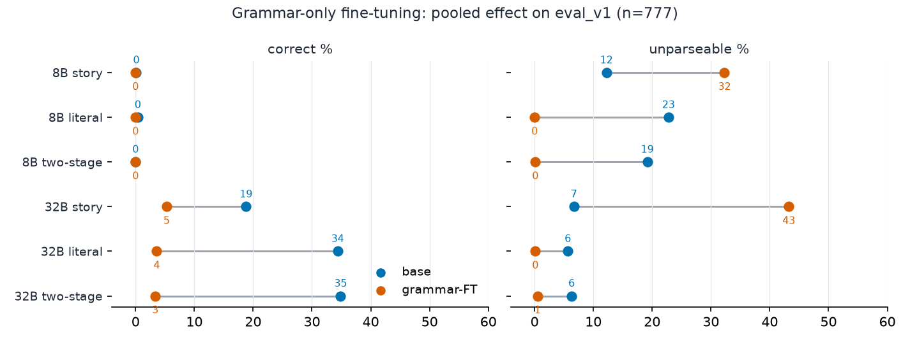

# Grammar-only fine-tuning: does rigid-grammar fluency training improve translation?

## Experiment

Fine-tune ONLY on raw rigid-grammar text (bare `ASSUME:/ASK:` lines, no stories,
no instructions, plain next-token loss) and test whether story-to-RG /
literal-to-RG translation improves on unseen equations. The grammar is identical
across all equations; only the specific laws differ, so grammar fluency is what
is allowed to transfer. Run on two models: Llama-3.1-8B-Instruct (near 0%
correct at base) and Qwen3-32B (13-61% correct at base), so effects are readable
in both directions. All grading is mechanical (checkform); kill criterion stated
before any run.

## Data

```
train_v1 (grammar text only, frozen, sha-pinned)
  easy 772 (ops 2-4, ETP laws) | medium 1,000 (5-8, ETP) | hard 1,000 (10-12, synthetic)
  + 100 beyond-length holdout (ops 14-16, never trained)
        v
  pair-disjoint from ALL 2,669 SAIR rows, law-disjoint from every evaluated
  problem, both under the grader's symmetry group (renaming, side swap,
  dualization); every sample round-trip verified through the grader's parser
        v
eval_v1 (frozen): 777 problems, 4 tiers (normal 180 / hard 197 / extra_hard 200
/ order5 200), rendered to story + literal + reference RG
```

## Setup

| | |
|---|---|
| Models trained | Llama-3.1-8B-Instruct (41.9M trainable), Qwen3-32B (134M trainable) |
| LoRA | r=16, alpha=16, all layers, q/k/v/o/gate/up/down projections, dropout 0 |
| Objective | causal LM on raw `text` field, packed 1024-token blocks, loss on all tokens, no chat template |
| Schedule | LR 2e-4 cosine, 3% warmup, micro-batch 1 x grad-accum 4, 3 epochs = 75 steps, seed 0 |
| Eval protocol (frozen) | vLLM bf16 greedy, no-think, fixed templates (sha-pinned), max_tokens 4096; chunked resumable runner |
| Checkpoints | every 10 steps + step 0, on the Modal volume |

## Training-side results (both models learn the grammar)

| Model | Loss (start -> end) | Holdout RG perplexity | Raw RG completion after FT |
|---|---|---|---|
| 8B | 0.71 -> 0.47 | 9.72 -> 2.49 | fluent, parseable RG |
| 32B | 0.69 -> 0.45 | 12.12 -> 2.41 | fluent, parseable RG |

## Behavioral results (translation on eval_v1, base vs FT)



| Model / arm | Correct, base -> FT | Unparseable, base -> FT |
|---|---|---|
| 8B story | 0.1% -> 0.0% | 12.2% -> 32.3% (runaway) |
| 8B literal | 0.4% -> 0.0% | 22.8% -> 0.0% |
| 8B two-stage | 0.0% -> 0.0% | 19.2% -> 0.1% |
| 32B story | 18.8% -> 5.3% | 6.7% -> 43.2% (runaway) |
| 32B literal | **34.4% -> 3.6%** | 5.7% -> 0.1% |
| 32B two-stage | **34.9% -> 3.3%** | 6.3% -> 0.5% |

Pooled over all 777 problems; per-tier tables in `runs/ft-v1/comparison.md`.

Three findings:

1. **Syntax is fully trainable.** On literal and two-stage prompts the FT models
   emit perfectly parseable grammar (unparseable to ~0% from up to 45% per tier).
2. **Story prompts trigger a non-stopping pathology.** The FT models stream RG
   until the token cap (nearly all unparseables are length-capped truncations);
   generation volume roughly triples, which is also why FT evals needed
   escalated timeouts and chunked runs.
3. **No semantic gain where capability is absent; displacement where it exists.**
   The 8B stays at 0% correct. The 32B, which translated at 34% pooled, drops to
   3-4%: it learned "always produce fluent RG" and that habit overrode
   "translate the input".

## Representation check

The FT-8B checkpoint was captured and probed identically to the base model
(probe-experiments, contrast_v1): law-disjoint AUROC 0.52-0.53 before AND after
FT, at the lexical floor. Grammar training changed how the model writes, not
what it represents about correctness. (Full probing/steering program:
`probe-experiments/RESULTS.md`.)

## Kill verdict

The grammar-bottleneck hypothesis is rejected in the strongest available form:
grammar-only continuation training is a **behavioral override, not a skill
injection**. It buys syntax, adds no semantics behaviorally or internally, and
displaces existing translation ability in a model that had it.

## Learnings for a v2 recipe

1. Put the TASK in the training distribution: instruction-formatted story->RG
   pairs (or completion-style with the story in context), never bare notation.
2. Disjointness must be computed under the grader's symmetry group or you leak
   answer keys (`data-gen/ftlib.py` has the canonical hashing).
3. Verify the format bridge before interpreting chat evals: perplexity + raw
   completion probes (both passed here, which is what makes the null clean).
4. Expect FT models to generate longer; budget eval timeouts accordingly (or
   use the chunked resumable runner).

## Artifacts

`train_v1/` + `eval_v1/` (frozen, manifests), `training/` (configs, presets),
`runs/ft-v1/` (train records, per-arm evals, `comparison.md`),
`runs/base-v1/` (base evals incl. Qwen3-32B). Repro:
`data-gen/` -> `training/run_train.sh` -> `eval/run_eval.sh <model> <arm>
[--adapter ...]` -> `eval/compare_table.py`.

---

# v2: task-pair fine-tuning with cross-grammar generalization (2026-08-19)

## Experiment

Mentor design: train on story->RG pairs in ONE grammar, then evaluate the
same frozen problems asked in never-trained grammars — separating "learned
translation" from "learned a format". Train: the exact train_v1 equation
pool re-rendered as stories (2,772 pairs + 100 holdout; theme `tea` held
out of training), instruction-formatted with the frozen story template,
completion-only loss, LoRA r=16 all layers, 3 epochs. Eval: eval_v1 (frozen
777) in grammar A (trained: ASSUME/ASK prefix), B-near (GIVEN/SHOW, f(a,b) —
surface re-skin), B-far (LAW/DERIVE, parenthesized infix — structural
change), each with story and literal input arms, vs base. Grading for B
grammars parses the new syntax and re-serializes into the unchanged grader
(transcode seam; leniency byte-identical to grammar A). Predictions and kill
criteria pre-registered in v2/DESIGN.md.

## Models

Llama-3.1-8B (base ~0% correct: injection test), Qwen3-32B (base 13-34%:
displacement test), + Ministral-3-14B (joined after a limit-200 signal
screen: 11.1% story; Gemma-4-31B screened 72.8% — above the signal zone,
excluded, and noted as the best base translator measured in this project).

## Behavioral results (pooled correct% / unparseable%, n=777 per cell)

| arm | 8B base | 8B FT | 14B base | 14B FT | 32B base | 32B FT |
|---|---|---|---|---|---|---|
| story A        | 0.1/12.2 | 96.8/0.4 | 14.0/16.2 | 89.4/0.4 | 18.8/6.7 | 99.7/0.0 |
| literal A      | 0.4/22.8 | 97.7/0.0 | 26.8/20.7 | 99.4/0.6 | 34.4/5.7 | 99.9/0.0 |
| story B-near   | 0.3/15.8 | 96.3/0.4 | 15.2/10.4 | 91.9/0.4 | 13.1/4.9 | 99.4/0.0 |
| literal B-near | 0.5/34.4 | 93.7/0.6 | 27.3/17.2 | 97.7/2.3 | 31.7/10.2 | 100.0/0.0 |
| story B-far    | 0.3/36.4 | 37.8/8.8 | 10.0/15.4 | 52.5/43.0 | 12.6/15.4 | 77.5/20.0 |
| literal B-far  | 0.3/39.9 | 36.7/61.5 | 30.5/24.1 | 47.6/52.4 | 20.1/18.7 | 81.5/15.1 |

Findings (8B + 14B, independently re-graded from raw responses):

1. **Task-pair FT teaches translation, not a format.** Both models transfer
   near-fully to the surface-reskinned grammar (B-near within a few points
   of the trained grammar) and to the never-trained literal input side.
2. **Transfer is graded by structural distance, and the gap closes with
   scale.** B-far gains are large everywhere but never reach A/B-near:
   ~+37 points (8B), ~+42/+17 (14B), ~+65/+61 (32B). Absolute far-grammar
   performance scales sharply — 8B ~37%, 14B ~50%, **32B ~80%** — so the
   structural ceiling is a capacity limit, not a limit of the method. The
   32B answers three grammars at 99-100% and a structurally alien one at
   ~80%.
3. **The far-grammar limit is syntactic, not semantic.** 14B order5 B-far
   collapses (24%/14.5%) while order5 in grammar A is its BEST tier (97%);
   119/152 failed order5 responses are unbalanced parentheses, only 5 are
   semantically wrong. Deep trees are free in the trained notation and a
   working-memory failure in the unfamiliar one. The 8B analog: literal-bfar
   failures leave literalform "Value n" names unexpanded while juggling the
   new syntax (composition failure; 0% label confusion in all B arms).
4. **No lock-in — but transfer peaks early and then decays.** 8B curve:
   A-skill saturates by step 300 while B-far RISES with it (23->52% by step
   500-600), then gives back ~6 points. 14B curve is sharper: at step 100
   the two grammars are TIED (61%/61%); B-far peaks at step 300 (74.5%) and
   decays to 59% by step 900 while A climbs 81->93%. Early training learns
   something grammar-general; continued training specializes it into the
   trained notation. The final checkpoint is therefore not the most
   transferable one — an endpoint-only experiment would have under-reported
   14B far-transfer by ~15 points. The 32B does NOT decay: A reaches 99% by
   step 100 and 100% from step 500, while B-far rises to 77.5% at step 100
   and holds 80-84% throughout. Specialization-away-from-generality shrinks
   with capacity: -6 points (8B), -15 (14B), none (32B).
5. **Not SFT narrowing.** Format-following control intact for 8B (100/90/100
   vs 100/100/100) and 14B (informative families 100->100; one family
   uninformative at base). 32B: 100/100/100 base AND FT — the model that
   ends near-perfect on three grammars loses nothing elsewhere.

## Representation results (law-disjoint linear probe on contrast_v1)

| model | base | after task FT | FT-unseen-laws subset (533 problems) |
|---|---|---|---|
| 8B  | 0.520 | 0.949 | 0.942 |
| 14B | 0.607 | 0.984 | 0.984 |
| 32B | 0.599 | 0.921 | 0.904 |

Task FT INSTALLS the internal correctness representation that v1's
grammar-only FT left untouched (8B stayed 0.52 in v1) — exceeding the
strongest natural representation measured anywhere in this project
(Qwen3.6-27B, 0.815), and holding at full strength on problems whose laws
the FT model never saw (exposure-clean subset, n_used verified). Shuffled
controls clean everywhere. R7 note: translation grades and probe AUROCs are
different instruments; they never share a table row.

## Contrast with v1 (the point of the whole program)

Same equations, same models, same GPU budget scale. v1 (raw grammar text,
next-token): behavioral override — syntax perfected, semantics unchanged
(8B) or displaced (32B 34->3%), representation untouched. v2 (same task as
eval, completion loss): translation learned, transfers by structural
distance, representation installed. The delta between the two recipes is
the task format alone.

## Quality control

Full adversarial audit (6 independent auditors + adversarial verification):
all 19,425 stored verdicts re-derived exact-match from raw responses;
summary math 0.0pp; row order clean in 25 run dirs; training loss provably
completion-only with a sha-verified prompt byte-bridge to eval;
train-vs-eval disjointness reconfirmed from scratch; grammar-B instrument
passed leniency-parity fuzzing (0% label confusion). Two confirmed minor
defects, both fixed and logged: a preemption-corrupted 14B loss-curve
record, and the "law-disjoint" claim scoped to probe-CV — corrected with
the exposure-clean subset probes above. RESEARCH_LOG.md entries 26-30.

## Verdict

**P1 (skill transfer) is confirmed in all three model families.** Task-pair
fine-tuning teaches translation, not a format: every model transfers
near-fully to a re-skinned grammar and to an untrained input side, and the
internal correctness representation is installed in all three (0.52->0.95,
0.61->0.98, 0.60->0.92 law-disjoint; holding at 0.90-0.98 on strictly
FT-unseen laws). P2 (format lock-in) is refuted — format-following controls
are intact everywhere, and checkpoint curves show far-grammar transfer
rising WITH the trained skill rather than being displaced by it. P3 (null)
is refuted outright.

The one real limit is structural: a grammar with different tree syntax
recovers only partially, and that gap is a capacity limit rather than a
method limit — far-transfer scales 37% -> 50% -> 80% with model size, its
failures are syntactic (unbalanced parentheses on deep trees) rather than
semantic, and the specialization-away-from-generality effect seen mid-training
in smaller models vanishes at 32B.

Together with v1's kill verdict this closes the arc the program set out to
test: **grammar was never the bottleneck — the task was.** Notation-only
training bought syntax and cost semantics; putting the task in the training
distribution bought the skill, the transfer, and the representation.
