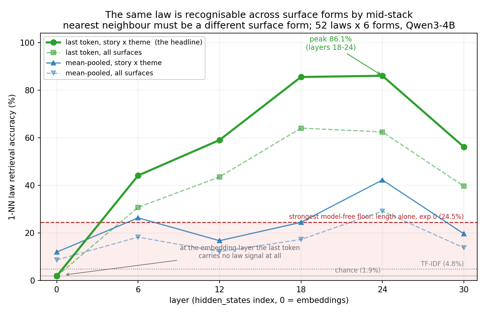
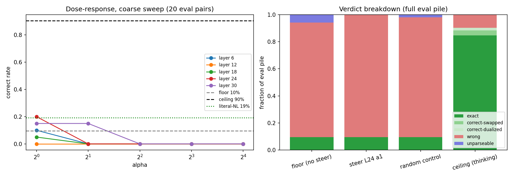
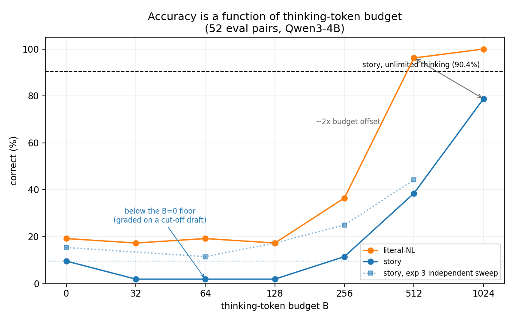

# Team update — experiments 1 and 3

Model `Qwen/Qwen3-4B`, seed 0, matched story / literal-NL / Rigid-Grammar pairs from the ETP set,
scored by the deterministic `checkform` parser. Two experiments: the contrastive steering vector
(exp 1) and the PCA / activation-structure pass (exp 3).

## The short version

The model already holds an abstract, surface-form-invariant representation of *which law* a problem
is by the middle of the stack — we can decode it at 86% against a 1.9% chance rate. But moving the
model along the story → literal-NL direction changes task accuracy by exactly nothing. What
actually separates 10% accuracy from 90% is the number of thinking tokens the model is allowed to
write, and the story framing costs roughly a 2× budget multiplier over its literal-NL twin.

So the bottleneck looks like **serial compute, not representation style**. "Represent this as a
math problem rather than a story" is not the missing step, because the model has largely done that
already and still fails.

## 1. The semantic core is there and it is strong (exp 3)

**How to read the metric.** We have 312 texts: 52 laws × 6 surface forms (four story themes,
literal NL, Rigid Grammar). For each text, find its nearest neighbour by cosine similarity in the
residual stream, **excluding every candidate that shares its surface form** so nothing can win by
matching its own twin. Score a hit if that neighbour encodes the same law. Chance is 1/52 = 1.9%.

In plain terms: pick up a story about grafting, remove everything else in that surface form, and
ask whether the closest thing left in activation space is the same law wearing a different costume.

*The answer is yes 86% of the time at layers 18–24. The x-axis is depth, and the inverted U is the
finding: the embedding layer has only words, and the forms share almost none, so it sits at chance;
by mid-stack the model has built something form-independent; by layer 30 it is re-specialising for
next-token prediction and the abstraction is partly overwritten. The two "story × theme" lines only
ever compare stories against stories of other themes — like against like, so only law identity can
separate them — while the "all surfaces" lines also allow story↔Rigid-Grammar matches, which are
harder because form dominates the geometry. The shaded band is the strongest floor any model-free
baseline reaches (word count alone, from exp 0).*

Two controls hold the result up:

- **Lexical.** The four story themes share almost no vocabulary by construction, and a TF-IDF
  baseline gets 4.8%. The strongest model-free floor we have (length alone, from exp 0) is 24.5%.
- **Structural shape.** Restricting retrieval to candidates with the same operation count, so shape
  carries no information inside the pool, still gives 92.8% against a 13.5% shape-only baseline —
  6.9×. The model represents *which* law it is, not just how big the law is.

Caveat worth stating plainly: this is decodability, not use. We do not yet know whether the model
reads from this representation when it formalizes. The two sections built to test that (a
faithfulness monitor and a law-transplant causal test) hit an OOM and did not run; the fix is
known and cheap, and exp 8 attacks the same question from another angle.

## 2. Steering along the story → literal direction does nothing (exp 1)

This was our "midpoint result" candidate, and it is a clean null.

The vector is real: per-pair differences cohere at cosine 0.63–0.91, so it is a consistent
direction rather than an average of noise. But across a layer × dose sweep, α = 1 is
indistinguishable from doing nothing (9.6%, **exactly** the unsteered floor, and the norm-matched
random control also scores 9.6%), while α ≥ 2 collapses generation into repetition loops. There is
no window in between. Gap closed: 0.0%.

*Left: every layer's dose–response sits at or below the unsteered floor and hits zero by α = 2 —
no curve goes up. Right: the steered condition and the random control are visually identical to
the floor, while the thinking ceiling is a different bar entirely. Note that steering converts
`wrong` into broken output, never into `correct`.*

Two details that make the null informative rather than merely disappointing:

- **α = 1 does register.** Diffing cached generations against baseline, the text differs on 52/52
  examples — the logits move on every input. It just moves nothing directional, and flips *fewer*
  verdicts than a matched-norm random direction does. That rules out a sweet spot below α = 1.
- **The ceiling for this intervention was always low.** Literal-NL no-think scores 19.2% versus
  story's 9.6%. Even a perfect story → literal conversion buys about 10 points, not the ~80 points
  of the thinking-mode gap. We were measuring a ~10-point effect against a ±5-point standard error
  on 52 examples, which is a power problem we should fix before another attempt.

The remaining unexplored variable is the **injection site**, not the dose — the current hook adds
the vector at every token position during prefill and decode, which is much heavier than the
literature usually applies. Parts 3 and 4 (local patch sites, and steering × budget) are written
and awaiting a run.

## 3. What actually moves accuracy: thinking-token budget (exp 1, part 2)

Capping thinking tokens at B and splicing in `</think>` when the budget runs out:

| B | story | literal-NL |
|---|---|---|
| 0 | 9.6% | 19.2% |
| 32 | 1.9% | 17.3% |
| 64 | 1.9% | 19.2% |
| 128 | 1.9% | 17.3% |
| 256 | 11.5% | 36.5% |
| 512 | 38.5% | 96.2% |
| 1024 | 78.8% | 100% |
| ∞ | 90.4% | — |

*Both arms are flat and near the floor until B = 256, then climb steeply. The dotted line is
exp 3's independent sweep on prompted stories — a different harness and prompt, so it replicates
the shape rather than re-measuring the curve.*

Three things to take from this:

1. **Small budgets are actively harmful** — story accuracy at B = 32–128 sits *below* the B = 0
   floor. A cut-off trace leaves a half-finished draft and the grader scores the draft. We should
   confirm this is a grading artifact rather than a real effect.
2. **The story penalty is a budget multiplier of about 2×.** Literal-NL hits 96% at B = 512 where
   story needs B = 1024 to reach 79%. That is a fairly direct measurement of the token cost of
   de-narrativizing.
3. **The story arm has not saturated at B = 1024** (only 4/52 traces closed naturally), so 79% is
   still climbing toward the 90.4% unlimited ceiling.

Exp 3's independent budget sweep reproduces the story column (15.4% at B = 0, 25% at 256, 44.2% at
512), so this is not a one-off.

## The finding that ties the two together

In exp 3 the thinking block is appended *after* the user turn, so under causal masking it cannot
reach the story tokens — the story-span activations are bit-identical regardless of budget. Yet
accuracy moves from 15% to 44% across that range.

**The information needed was already present while the model was failing 85% of the time.** Thinking
does not add comprehension here; it adds serial room to unpack a representation the model already
had. That is consistent with the steering null: you cannot fix a compute bottleneck by editing the
representation, because the representation was not what was broken.

## What we would do next

- Rerun the causal sections of exp 3 (faithfulness monitor, law transplant) after the OOM fix,
  reading at the story-end position, which is where retrieval is strong.
- Run exp 1 parts 3 and 4: local injection sites, and steering × budget. The sharp hypothesis is
  that a vector genuinely performing the abstraction step should shift the dose–response curve
  *left* — same accuracy at smaller budget — even though it buys nothing at B = 0.
- Extend the story budget sweep past B = 1024 to find where it saturates.
- Before any further steering attempt at B = 0, enlarge the eval set. At 52 pairs it cannot cleanly
  resolve even its own best case.

Full detail, including per-layer tables and controls, is in
[`01-contrastive-steering-story-to-literal-findings.md`](01-contrastive-steering-story-to-literal-findings.md)
and [`03-pca-activation-structure-findings.md`](03-pca-activation-structure-findings.md).

Figures are in [`team-update-figures/`](team-update-figures). The steering panel is saved output
from the run itself. The retrieval curve and the budget curve are redrawn from the reported numbers
by [`make-retrieval-figure.py`](team-update-figures/make-retrieval-figure.py) and
[`make-budget-figure.py`](team-update-figures/make-budget-figure.py) — the notebook's own retrieval
figure omits the strongest line and draws a weaker floor, and the budget sweep's figure lives in
Drive rather than the repo. The notebook original is kept alongside as
`01-semantic-core-by-layer-notebook-original.png`.
