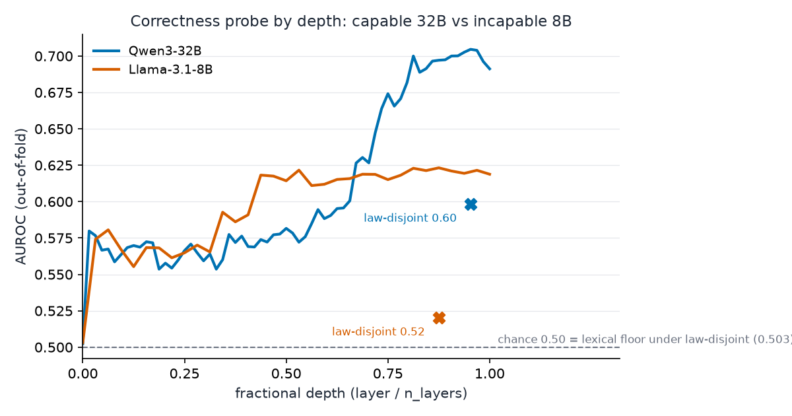

# Probing: is translation correctness linearly represented?

## Experiment

Llama-3.1-8B-Instruct reads a story (informalized ETP implication) plus a candidate
rigid-grammar answer. Question: can a linear probe on its hidden states separate correct
from wrong answers, and does that hold on unseen equations? Pre-registered in `PLAN.md`.
Background: this model scores ~0-1% when *producing* these translations
(`ft-experiments/runs/base-v1`), so this tests whether evaluation exists internally even
where generation fails.

## Data creation (contrast_v1)

```
sample 1,000 implication pairs      seed 0, vacuous excluded
  easy 334 (ops 2-4, ETP) | medium 333 (5-8, ETP) | hard 333 (10-12, genform)
        v
render story (repo renderer)        back-parse must recover the source laws
        v
correct answer = reference RG       must re-grade "correct", identity transform
        v
wrong answer = ONE AST edit         arg_swap 226 / var_sub 274 / prune 247 / grow 253
        v                           must re-grade well-formed "wrong"
        v                           193 edits inside grader symmetries: rejected, redone
freeze + verify                     manifest, sha256, 2,000 texts, exact 50/50
```

Labels are mechanical end to end (checkform only, R1).

## Setup

| | |
|---|---|
| Model | meta-llama/Llama-3.1-8B-Instruct, bf16, read-only (no generation) |
| Input | bare text: story + blank line + answer, no chat template |
| Captured | residual stream, all 33 layers, two sites (last answer token; mean over answer tokens) |
| Probe | StandardScaler + logistic regression, per layer per site |
| Splits | primary: 5-fold GroupKFold by problem. Strict: by law component (largest holds 556/1000) |
| Controls | char TF-IDF on answers, answer length, layer 0, shuffled labels x3 |
| Frozen | dataset sha-pinned, capture bound to that sha, all seeds and probe config fixed |
| Steering | not run: pre-registered direction comes from the best probe layer, which did not generalize (below) |

## Expected (written before running)

H1: probe well above all baselines and stable on held-out laws. Refuted if it matches
the bag-of-words floor out-of-law. Lab precedent on a related task with a competent
model: 0.96 AUROC. H2: steering shifts verdicts monotonically, random direction flat.

## Result



In-distribution the probe reaches 0.623 (mean site, layer 28) and 0.599 (last site,
layer 32), above the 0.539 lexical floor; layer 0 is 0.50 and controls are clean
(shuffled 0.49-0.52, length 0.505). On the law-disjoint split it drops to 0.52-0.53,
i.e. the lexical floor: the signal is tied to specific equations, not a general
correctness direction. At the best layer: easy 0.695 vs medium/hard ~0.59; size-changing
edits most visible (prune 0.686, grow 0.648), the order-semantic arg_swap least (0.565).
**H1 refuted under the pre-registered condition. H2 dropped (premise removed).**
Full numbers: `runs/probe-v1/probe_results.json`.

## Round 2 (2026-08-14): nonlinear probes and the model ladder

**MLP twin.** Every linear probe re-fit as an MLP (128 hidden, same captures, same
grouped splits): best 0.555 in-distribution, law-disjoint 0.504, controls clean.
Nonlinearity does not rescue the signal (`runs/probe-v1/probe_results_mlp.json`).

**Behavioral verification gate.** Frozen prompt: story + candidate, "is this
formalization correct, yes or no", greedy, 300 balanced texts (50 problems/tier,
seed 0). Diagnostic arm adds one worked yes/no example pair (separate template,
tagged `-fewshot`). All records in `runs/verify-v1/`, zero unparseable anywhere.

| Model | Primary | Few-shot | Yes-rate (primary) | Yes-precision |
|---|---|---|---|---|
| Llama-3.1-8B | 0.500 | - | 0.000 | n/a |
| Qwen2.5-7B | 0.520 | 0.503 | 0.027 | 0.88 |
| Qwen3-32B | 0.537 | 0.590 (easy 0.67) | 0.063 | 0.79 |
| Llama-3.3-70B | 0.540 | 0.533 | 0.053 | 0.88-1.00 |

Read: no model reaches the 0.65 gate under either elicitation, so per the
pre-registered rule there is no capture target and the ladder stops. The failure
mode is uniform: near-universal "no" with rare but precise "yes" (0.79-1.00),
i.e. weak signal far below threshold, not blindness. Capability rises with scale
plus few-shot (32B crosses 0.65 on the easy tier only). Consistent with the
probing null: models that cannot verify behaviorally do not carry a general
correctness direction.

## Round 3 (2026-08-15): logit-margin gate and the Qwen3-32B probe

**Margin gate** (threshold-free: margin = logit("yes") - logit("no") at the answer
position, AUROC vs labels; `runs/verify-v1/*-margin.json`): 8B 0.522, 7B 0.564,
**32B 0.669** (per-tier 0.74 / 0.69 / 0.57), 70B 0.629. Qwen3-32B is the smallest
model clearing ~0.65 and beats the 70B; captured per the gate rule.

**Qwen3-32B probes** (same dataset, same splits, same controls;
`runs/probe-32b/`): linear, mean site, best layer 61/65: **0.705 in-distribution,
0.599 law-disjoint** (folds 0.588-0.641, all above the floor), easy tier 0.793.
Lexical floor recomputed under the SAME law-disjoint split: **0.503 (chance)**.
MLP twin: 0.578-0.600 law-disjoint (no nonlinear gain). Shuffled labels 0.48-0.52.

Read: a law-general, linearly decodable correctness signal exists in the capable
model's deep layers and is absent in the incapable 8B (0.520); probe and
behavioral profiles agree tier by tier. H1, refuted on 8B, is supported on 32B.
Caveat: word-level elicitation still fails everywhere (best 0.59); the signal is
below the model's margin readout on hard problems for both instruments.

## Open questions

1. Steering (H2) now has a premise: inject the layer-61 direction, site-restricted, negated-vector and norm-matched controls (Denis's exp-1 Part 3 design).
2. Grammar-FT checkpoint: does FT move the 8B toward the 32B's representational state?
3. Thinking-on gate arm for Qwen3-32B (protocol variant, flagged).

Repro: `data-gen/build_contrast.py` -> `data-gen/verify_contrast.py` ->
`modal run capture/modal_capture.py` -> `probing/fit_probes.py` -> `analysis/make_figure.py`;
gate: `behavior/run_verify.sh <model-key> [--template verify_prompt_fewshot.md]`.
